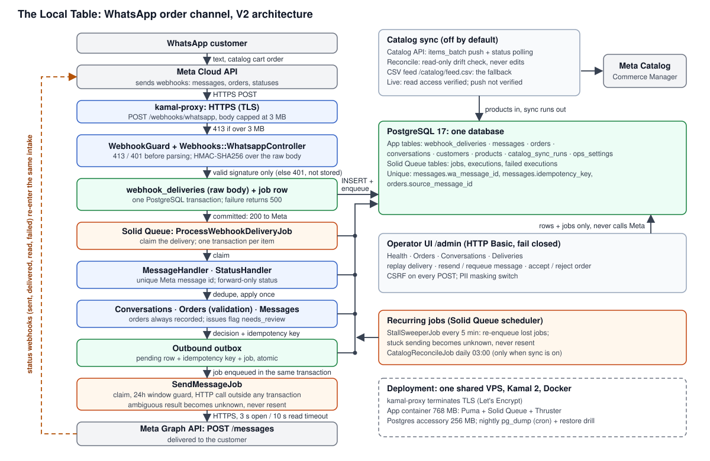

# The Local Table: a WhatsApp Catalog + Cart order channel

A production-oriented reference implementation of a WhatsApp ordering channel on
Rails 8.1 and the WhatsApp Cloud API. A customer browses a restaurant's menu in
WhatsApp's native Catalog, sends a Cart, and gets a receipt; an operator accepts
or rejects the order in a small admin UI and the customer is told. "The Local
Table" is a fictional restaurant: the menu is seed data (20 dishes), and nothing
here is a commercial product.

The point of the project is not the restaurant. It is what it takes to build on a
messaging platform whose responses cannot be taken at face value, and to show
evidence for each claim rather than assert it.

[](https://github.com/amitkssolanki/whatsapp-integration/actions/workflows/ci.yml)
**Verified against real Meta traffic (2026-10-06)**, one session, the author as the
only customer.

[Case study](docs/portfolio/CASE_STUDY.md) |
[Technical deep dive](docs/portfolio/TECHNICAL_DEEP_DIVE.md) |
[Verification session evidence](docs/evidence/2026-10-06-verification-session-1.md) |
[V1 field guide (article)](https://amitsolanki.com/writing/whatsapp-catalog-cart-field-guide/) |
[Live environment](https://whatsapp.railsfanatics.com) (public menu; the admin is private)

## Why it exists

A WhatsApp integration looks easy until it meets real traffic. The platform's
behaviour makes four assumptions unsafe:

- **Webhooks are at-least-once and unordered.** The same status can arrive twice,
  from two Meta hosts, within one second, and `delivered` can be skipped entirely
  when a message is read at once.
- **`200 OK` from the send API is not delivery.** The truth about a message arrives
  later, in status webhooks, or not at all.
- **Failures are configuration-dependent.** The same error code can mean a bug in
  the request or a switch that is off in a settings page nobody looked at.
- **The send API has no idempotency key.** A timeout after the request was written
  may mean Meta already has the message.

**V1 to V2.** V1 (tag `v1`) was a working demo: a CSV feed for Commerce Manager,
a webhook that created orders, and automatic replies. Its live run on 2026-08-08
(52 webhook POSTs from Meta: 36 status webhooks, 13 text messages and 3 orders)
showed what it got wrong. It discarded all 36 status webhooks, answered HTTP 200
for 7 processing errors that were recorded only in the log (five were Meta's 131009
on catalog cards, so a customer who said "hi" got nothing back), stored a placeholder
instead of what it had actually sent, and had no uniqueness constraint on message
ids. V2 is a rebuild around those findings: store every delivery before
interpreting it, apply every logical event once, track the real fate of every
outbound message, and make every failure visible and recoverable.

## Architecture



- **Intake is synchronous and never calls Meta.** The controller verifies the
  HMAC over the raw body, then stores the raw delivery and enqueues the processing
  job in one transaction, and answers 200. A database failure answers 500 so Meta
  retries.
- **Solid Queue lives in the primary PostgreSQL database**, so the stored delivery
  and its job commit or roll back together. One Rails process (Puma with the Solid
  Queue supervisor inside), one database, no Redis.
- **Processing is asynchronous and per item.** Each message or status in a delivery
  is applied in its own transaction; one bad item does not roll back the others.
- **Outbound goes through an outbox.** A decision writes a pending row and a job
  atomically; the send job claims the row and calls Meta outside any transaction.
- **Status webhooks re-enter through the same intake** and move the lifecycle
  forward.
- **The operator UI only writes rows and enqueues jobs**; it never calls Meta from a
  request.
- `WhatsappClient` and `Catalog::Client` are the only code that talks to Meta, and
  they return classified results instead of raising for API or transport problems.
  `Conversations::Responder` decides what to say and never sends; replies are
  canned text and one catalog card, no LLM.

The full contract (schema, state tables, HTTP contract, validation rules) is
[docs/v2/DESIGN.md](docs/v2/DESIGN.md).

## Reliability

- **Durable, store-first ingestion.** The raw body is stored before anything is
  interpreted, so a processing bug does not lose a stored delivery. Bodies PostgreSQL text
  cannot hold (invalid UTF-8, NUL) keep their exact bytes in base64 so the
  signature can still be re-verified on replay.
- **Per-item idempotency.** A unique Meta message id with
  `INSERT ... ON CONFLICT DO NOTHING` inside the item transaction; a duplicate
  skips every side effect. Orders are unique per source message; outbound decisions
  carry an idempotency key; statuses fill a lifecycle timestamp with a conditional
  `UPDATE`. Exact redeliveries are kept and counted, not discarded.
- **Async processing with claims.** State changes go through one conditional
  `UPDATE ... WHERE status IN (allowed sources)`; the database decides who wins and
  a losing worker treats it as a no-op.
- **Outbound outbox plus claim.** Meta is never called inside a transaction.
- **Ambiguous outcomes become `unknown` and are never resent.** A read timeout, or a
  reset after the request was written, may mean Meta has the message. It stays
  visible and resolves only if a status webhook arrives; operators may resend only
  `failed` messages in fixable categories.
- **Forward-only lifecycle.** `accepted < sent < delivered < read`; each timestamp is
  written once, even for a late or out-of-order status. A `failed` after
  `delivered` changes nothing and is recorded as an anomaly. A status that arrives
  while a send is still in flight or scheduled for retry settles it, and a retry
  refuses to send a second copy.
- **Correlation.** Each send carries our message id in `biz_opaque_callback_data`
  as a secondary key; Meta's message id is the primary one.
- **Error taxonomy by Meta error code** (HTTP status only as a fallback, and
  `error_data.details` where one code has several causes): retryable, permanent,
  configuration, ambiguous. Retries back off 30 s, 2 min, 10 min, 30 min, then
  fail visibly.
- **24-hour window guard**, checked immediately before the HTTP call with a
  5-minute safety margin. A closed window yields `blocked` and no call to Meta.
- **Order validation that never rejects.** The customer already saw the prices, so
  every order is recorded and priced as the customer saw it. Unknown SKU, price
  mismatch, unavailable product, invalid quantity, currency or catalog mismatch set
  `needs_review` for the operator. Money is integer cents; prices are parsed with
  `BigDecimal`, never `to_f`.
- **Safe replay.** An operator can replay a stored delivery; the signature is
  re-verified against the stored bytes and the same code path runs, so replay
  does not duplicate applied items.
- **Self-healing sweeper.** A recurring job moves stuck deliveries to `failed` and
  re-enqueues them, and moves sends stuck in `sending` to `unknown`.

## Security

- **Webhook signature fails closed.** HMAC-SHA256 over the raw post body, compared in
  constant time. No app secret configured means every POST is refused.
  Unsigned or forged requests get 401 and are not stored.
- **Request body limit.** Over 3 MB is refused with 413 by a Rack middleware before
  Rails parses the body (and by the proxy's own limit).
- **Admin auth fails closed.** HTTP Basic; if either credential is unset nobody gets
  in. The webhook controller skips CSRF (it is signature-authenticated); the admin
  forms use Rails CSRF protection.
- **Development switches cannot reach production.** `ADMIN_AUTH_DISABLED=1` and
  `WHATSAPP_ALLOW_UNSIGNED=1` work only in development and test. Production refuses
  to boot without the Meta token, phone number id, verify token, app secret, admin
  credentials and `APP_HOST`, or with unsigned webhooks allowed.
- **PII rules.** Meta message ids embed phone numbers, so they are never logged or
  shown; logs carry the app's own ids. `AppLog` rejects forbidden fields (bodies,
  phone numbers, names, Meta ids) and raises in development and test. Error text
  that did not come straight from Meta passes through `Redact`. The admin
  deliveries pages never load `raw_body`, and `DEMO_MASK_PII=1` masks numbers and
  names in every admin view. Raw bodies and payloads are stored as received and do
  contain PII; `ops:purge` removes them after a chosen date.
- **Secrets are out of the repository.** They live in a private file used at deploy
  time; the repository holds `.env.example` only.
- **Fail-closed placeholders.** Until the real Meta values existed, the deployment
  ran with placeholders that refuse every webhook rather than accept unverified ones.

## Verification

Evidence is labelled by kind. Each row says what the claim rests on, and the last
row is what is deliberately not claimed.

| Kind | What was checked | Evidence |
|---|---|---|
| **Automated** | 1,111 RSpec examples, 0 failures (local and GitHub CI on `main`). CI jobs: `lint` (RuboCop), `security` (Brakeman with `--exit-on-warn`, bundler-audit), `test` (RSpec on PostgreSQL 17) | The specs and workflow in this repository. They check the code against sanitized real V1 payloads and stubs; they say nothing about how Meta behaves |
| **Real Meta verification** (session 1, 2026-10-06) | 10 real webhook deliveries (3 messages, 7 statuses), all processed exactly once; 0 duplicates, 0 orphans, 0 failed jobs. **The 131009 failure and recovery:** the first catalog card was rejected with 131009 because the new number's commerce settings had the catalog off (it was linked only at account level); the owner enabled it by hand in Meta's settings and the next "Hi" got a working catalog card (nothing was retried automatically). V1's log held the same cause among its five 131009 errors, next to a request bug and a missing catalog product, but V1 kept errors only in a log line and could not tell them apart; V2 stored the code and details on the message, so the diagnosis was immediate. V2's classifier was changed the same day to read `error_data.details`. Order #9 (2 lines, $24.50) matched the catalog price. Statuses tracked to `read`; `delivered` was skipped twice when a message was read immediately. `biz_opaque_callback_data` echoed on all 7 status webhooks. Catalog read access verified (20 products) | [Session write-up](docs/evidence/2026-10-06-verification-session-1.md) |
| **Deployment** (live host, 2026-10-06) | HTTPS with a valid certificate; `/up` 200; HTTP redirects to HTTPS; wrong verify token 403; unsigned POST 401; forged signature 401; 4 MB body 413; admin 401 without or with wrong credentials. A deliberately unloadable job recorded as failed. Container restart: healthy again in about 6 seconds with data intact. `pg_dump` backup restored into a scratch database with identical row counts and schema version | [Session write-up](docs/evidence/2026-10-06-verification-session-1.md), [runbook](docs/deploy/RUNBOOK.md) |
| **Simulated / demo** | A synthetic seed (12 scenarios, no real HTTP), gated fault injection, and a local demo simulator. Everything they create is flagged `synthetic` or labelled `injected`, shown with a badge in the admin, and excluded from the `real` section of `ops:report` | Specs; `demo:*` and `ops:*` tasks. Not evidence of Meta's behaviour |
| **Not verified / not claimed** | See [Limitations](#limitations). In short: no multi-week operating period (it was planned in the original validation plan and intentionally not pursued for this portfolio reference implementation); no long-term reliability, uptime, latency or volume statistics; no real customers besides the author; several Meta behaviours seen only in simulation | n/a |

Four AI review rounds by a separate reviewer model found real defects that were
fixed: a late status for an old Meta id that could be applied to a resent message,
a retryable failure that could resend a message Meta had processed, a purge that
left personal data behind, injected-fault labels that could be lost, and the real
business number (one spec line) and the server address (deploy history), both
removed before the first public push. Separately, the admin inherited from V1 had no
authentication until the operator-UI phase added fail-closed auth. Running it for
real found three more defects (plus a masking bug in the setup check): a
helper method that shadowed `ActiveJob#enqueue`, a CI run that failed 133 specs
because `db:prepare` seeded the test database, and the verify token appearing in the
web server's access log.

## Deployment

Kamal 2 to a single shared VPS, with kamal-proxy terminating TLS (Let's Encrypt).
PostgreSQL 17 runs as a Kamal accessory on the same host; Solid Queue runs inside
Puma. Both containers are memory-capped. A nightly `pg_dump` runs by cron
(installed; first scheduled run 2026-10-07) and a restore drill (into a new
database, never over the live one) was run on 2026-10-06. An off-host copy is a
documented procedure in the runbook that has not been performed, and there is no
heartbeat or uptime monitor. There is no staging environment and no high
availability.

The live environment is https://whatsapp.railsfanatics.com: the menu is public,
the admin is private. The server address is not in the repository. The procedure, secrets handling, rotation, restore and a
pre-flight checklist are in [docs/deploy/RUNBOOK.md](docs/deploy/RUNBOOK.md).

Meta dashboard steps (app, System User token, webhook callback and subscription,
catalog connection) are performed by hand by the account owner. Nothing in this
repository drives them; `script/meta/check_state.rb` is a read-only checker (GET
requests from a fixed allowlist, no write path).

## Operator UI

All under `/admin`, behind Basic auth. Most pages refresh every 5 seconds. Every
write action records the operator's username and logs an event. None calls Meta
from the request.

| Page | Shows |
|---|---|
| Health (`/admin`, landing) | Failed and partially failed deliveries with "Replay all failed"; outbound counts by status; failed sends by category with a bulk resend for fixable ones; `unknown` sends; undelivered over 10 minutes; blocked by the window; retry-scheduled; orders needing review; orphan and anomaly counts; failed background jobs; a banner when recent failures are all configuration; catalog sync state with "Sync now" and "Reconcile now" |
| Orders | Filters by state and `needs_review`. Detail shows each line with the customer's price beside the catalog price, validation issues, accept, and reject (internal reason required, not sent to the customer). Warns when the window is closed |
| Conversations | List with 24h window state; per-customer timeline with delivery state, error details, and per-message Resend, Requeue, and "Override window (experiment)" behind a confirmation |
| Deliveries | Every stored POST filtered by status, with per-item outcomes (references masked), attempts, replay count and last error; replay re-verifies the stored signature first |
| Products | Menu with availability, synced or not, last sync time and error |

The public menu (`/`, `/products/:id`) and `GET /catalog/feed.csv` are
unauthenticated by design; `GET /up` is the health check.

## Design decisions

- **Solid Queue in the primary database.** Removes the "stored but never enqueued"
  window without an outbox relay. The cost is that queue load shares the application
  database: acceptable at this scale, not at a larger one.
- **No automatic resend of ambiguous sends.** With no send idempotency key, a
  duplicate to a customer is worse than a visible `unknown`. The trade-off is that
  some sends stay `unknown` until an operator looks.
- **Always record orders, flag problems.** Rejecting a cart the customer already saw
  priced would be the worse failure. Two identical carts sent separately are two
  orders; they are not deduplicated.
- **Customer identity by business-scoped user id** when present, else phone number;
  identifiers are only filled in, never overwritten.
- **Catalog push plus read-only reconcile, CSV feed as fallback.** With
  `CATALOG_SYNC_ENABLED=true`, a product edit enqueues a debounced `items_batch`
  push keyed by a digest of the Meta-visible fields; reconcile reads the catalog
  back daily, records drift and never corrects it. Off by default and not verified
  against Meta (see Limitations). Details: [docs/v2/CATALOG.md](docs/v2/CATALOG.md).

## Running locally

Requires Ruby 3.4.7 and PostgreSQL.

```bash
bundle install
bin/rails db:prepare db:seed     # schema, then the 20-item menu
bin/dev                          # Puma with the Solid Queue supervisor inside
```

Open `http://localhost:3000/admin`. For local use, either set
`ADMIN_AUTH_DISABLED=1` (development and test only; the operator becomes
`dev-operator`) or set `ADMIN_USER` and `ADMIN_PASSWORD`. To post unsigned
webhooks with curl, set `WHATSAPP_ALLOW_UNSIGNED=1` (same restriction).
`bin/setup` also works but clears logs and tmp files. Real Meta traffic needs a
public HTTPS URL for `/webhooks/whatsapp`; that is not automated here.

To see the UI populated without Meta, `bin/rails demo:seed_integration CONFIRM=yes`
plays 12 clearly synthetic scenarios through the real controller and jobs, with an
in-process fake for Meta; synthetic customers can never be sent to.

### Configuration

Copy `.env.example` to `.env` (loaded by `dotenv-rails` in development and test).

| Variable | Purpose |
|---|---|
| `WHATSAPP_TOKEN` | System User token for the Graph API |
| `WHATSAPP_PHONE_NUMBER_ID`, `WHATSAPP_BUSINESS_ACCOUNT_ID` | Sending number (Meta's id for it) and account |
| `WHATSAPP_DISPLAY_PHONE_NUMBER` | Optional. Used only by the setup check; keep it out of tracked files |
| `WHATSAPP_VERIFY_TOKEN` | Value you choose; must match Meta's webhook config |
| `WHATSAPP_APP_SECRET` | Verifies `X-Hub-Signature-256` |
| `WHATSAPP_ALLOW_UNSIGNED` | `1` skips signature checks; development and test only |
| `ADMIN_USER`, `ADMIN_PASSWORD` | Operator UI credentials; required in production |
| `ADMIN_AUTH_DISABLED` | `1` disables admin auth; development and test only |
| `DEMO_MASK_PII` | `1` masks phone numbers and names in the admin UI |
| `CATALOG_ID`, `CATALOG_SYNC_ENABLED` | Catalog target; `true` turns on push and scheduled reconcile (default off) |
| `WHATSAPP_API_VERSION` | Graph version, default `v26.0` |
| `APP_HOST` | Public host used in catalog item links; required in production |

### Tests and CI

```bash
bundle exec rspec                 # needs PostgreSQL; DATABASE_URL overrides the test database
bin/rubocop
bin/brakeman --no-pager && bin/bundler-audit
```

`.github/workflows/ci.yml` runs three jobs on pull requests and pushes to `main`:
`lint` (RuboCop), `security` (Brakeman, bundler-audit) and `test` (RSpec against
PostgreSQL 17). CI loads the schema rather than running `db:prepare`, which would
seed the test database.

Test highlights: real-thread concurrency specs (webhook dedupe, send claim,
customer creation); all 24 orderings of accepted/sent/delivered/read end at `read`
with every timestamp; integration specs for a stale status arriving after a resend;
and a synthetic seed that runs in a self-checking transaction and rolls back if any
guarantee is violated, including any attempt to reach the network.

### Operational tooling

- `bin/rails ops:report FROM=... TO=... FORMAT=md` prints delivery, order, outbound,
  latency, status-anomaly, window, catalog and inbound metrics computed only from
  the database, twice: `real` (nothing injected, synthetic or simulated) and `all`,
  plus an `injected` summary by label.
- Fault injection (`processing:order`, `send:5xx`, `send:read_timeout_after_send`)
  makes deliberate, permanently labelled failures. It is switched on the Health page
  and allowed only in development and test, or in production with
  `FAULT_INJECTION_ALLOWED=1`; Health shows a red banner while any toggle is on.
- `bin/rails ops:repost_delivery ID=... CONFIRM=yes` re-ingests a stored delivery as
  a new delivery labelled `injected:repost`, so it never counts as one of Meta's own
  duplicates.
- `bin/rails ops:purge BEFORE=YYYY-MM-DD CONFIRM=yes` removes raw bodies, message
  text, Meta message ids, order notes and customer names and numbers older than the
  date; counts and statuses stay.
- `bin/rails demo:simulate` builds a local simulated dataset for screenshots; it runs
  only in development against a database whose name contains `_demo`.

## Limitations

What this does not do, and what has not been shown:

- **No multi-week operating period.** It was planned in the original validation
  plan and intentionally not pursued for this portfolio reference implementation.
  There are no long-term reliability, uptime, latency or volume statistics, no
  production-scale traffic, and no real customers besides the author.
- **Not verified against Meta**: Catalog API push (`items_batch`) and reconcile;
  correlation-id echo on a `failed` status; a real duplicate delivery handled by V2;
  the 24h window block and override; real orders with a price mismatch, unknown SKU,
  unavailable product or invalid quantity; real retryable or ambiguous send
  failures. All are covered by specs and the synthetic seed, which is simulation.
- **Catalog push is off by default** and unverified; the CSV feed is the fallback.
- **One restaurant, one WhatsApp number, one operator.** No multi-tenancy. Operator
  auth is a single shared Basic credential: no per-user accounts or roles.
- **No template messages.** A closed 24h window blocks sends; a template fallback
  would need a Meta-approved utility template.
- **No payments, POS integration, delivery logistics or LLM.** Replies are canned.
- **One shared host, one database volume**, no staging environment, no high
  availability.
- Several error-code categories come from Meta's documentation, not from observed
  traffic; only those seen in V1 and session 1 are real.

## Evidence and docs map

| Where | What |
|---|---|
| [docs/portfolio/CASE_STUDY.md](docs/portfolio/CASE_STUDY.md), [TECHNICAL_DEEP_DIVE.md](docs/portfolio/TECHNICAL_DEEP_DIVE.md) | The story and the engineering detail |
| [docs/evidence/](docs/evidence/) | Verification session 1 (2026-10-06): real traffic, the 131009 failure, deployment checks |
| [docs/v2/](docs/v2/) | `DESIGN.md` (the implementation contract), `meta-research.md` (documentation findings), `CATALOG.md` |
| [docs/deploy/RUNBOOK.md](docs/deploy/RUNBOOK.md) | Deployment, secrets, backups, restore |
| [docs/operating/](docs/operating/) | The operating-period protocol, schedule and templates, kept as part of the original validation plan. The period itself was not run |
| [spec/fixtures/meta/v1/README.md](spec/fixtures/meta/v1/README.md) | Which fixture fields are sanitized real V1 payloads and which are synthetic |
| [Field guide](https://amitsolanki.com/writing/whatsapp-catalog-cart-field-guide/) | The V1 article: lessons behind the design |

## Repository map

| Path | Contents |
|---|---|
| `app/controllers/webhooks/`, `app/middleware/webhook_guard.rb` | Intake: handshake, POST handler, size and signature-header precheck |
| `app/services/webhooks/` | `Ingest`, `DeliveryProcessor`, `MessageHandler`, `StatusHandler`, `Payload` |
| `app/services/whatsapp/`, `whatsapp_client.rb` | `Signature`, `ErrorClassifier`; the only outbound caller of the Cloud API |
| `app/services/messages/outbox.rb`, `conversations/responder.rb`, `orders/builder.rb` | Outbound decisions and order validation |
| `app/services/catalog/` | Field mapping, feed, API client, price parser, reconciler |
| `app/jobs/`, `app/services/health/`, `app/services/ops/` | Processing, sending, sweeper, catalog jobs; Health snapshot; reports |
| `app/models/` | State machines (`Message`, `WebhookDelivery`, `Order`) via `concerns/status_transitions.rb` |
| `app/controllers/admin/`, `app/views/admin/` | Operator UI |
| `config/deploy.yml`, `config/recurring.yml`, `config/initializers/production_config_check.rb` | Deployment, schedules, boot checks |
| `script/backup/`, `script/meta/` | Backup and restore; read-only Meta check |
| `spec/fixtures/meta/v1/` | Sanitized real V1 payloads |

## Author

Built by Amit Solanki with AI-directed development (Claude Code); every commit
carries a `Co-Authored-By: Claude` trailer. All actions in Meta's and Facebook's
dashboards were performed by the author personally.
