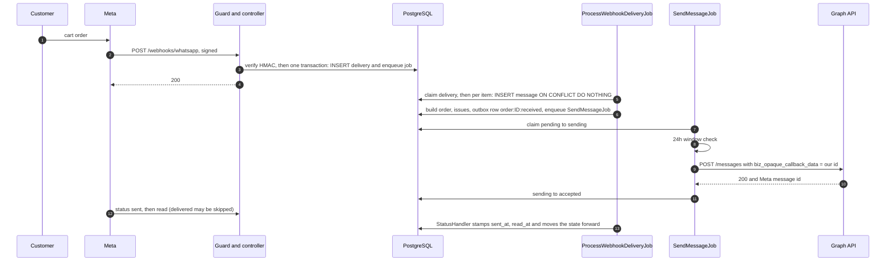
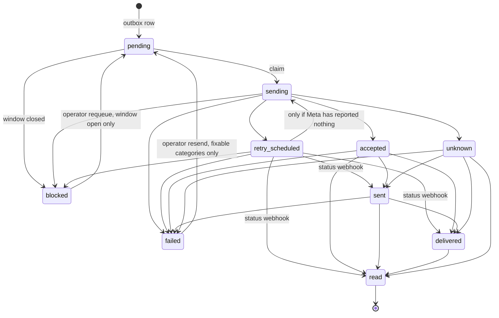

# Technical deep dive: a WhatsApp order channel that does not trust its platform

The engineering view of "The Local Table", a fictional restaurant that takes orders through WhatsApp's native Catalog and Cart. It covers behaviour under duplicate deliveries, lost responses, out-of-order statuses and operator mistakes, and what was and was not checked against real Meta traffic.

Stack: Ruby 3.4.7, Rails 8.1.4, PostgreSQL 17, Solid Queue (in the primary database, run inside Puma), Faraday, RSpec, Kamal 2.12, kamal-proxy. Code: https://github.com/amitkssolanki/whatsapp-integration. Built with AI-directed development (Claude Code); every commit carries a `Co-Authored-By: Claude` trailer. All Meta and Facebook account actions were performed by the author.

**Scope.** One restaurant, one number, one operator, no template messages. No multi-week operating period (planned originally, intentionally not pursued), no uptime, latency or volume statistics, and the only real customer was the author. Live-verified behaviour is labelled as such; the rest is covered by specs and simulated.

## 1. Architecture overview

V1 (tag `v1`, live run 2026-08-08) received 52 real webhook POSTs from Meta: 36 status webhooks (35 distinct events), 13 texts (one of them Meta's dashboard test sample) and 3 orders. It discarded all 36 status webhooks, answered seven processing errors with 200 and kept them only in a log line (five #131009 and one #131030 on Meta's webhooks, one Ruby `TypeError` from a local test POST), and stored seven of ten outbound rows as the placeholder `(auto-reply sent)` with no Meta message id. Meta also delivered the same `delivered` status twice in the same second, and V1 had no unique constraint.

V2's rules: **store first** (every authenticated POST is persisted raw before interpretation); **exactly once per logical item** (every item goes through a unique key); **outbox for sending** (a decision is a row plus a job, written atomically; Meta is never called inside a transaction); **ambiguity is a state** (a send that might have reached Meta becomes `unknown` and is never resent automatically); **every failure is visible** (HTTP status tells Meta whether to retry, the Health page tells the operator what failed).

One PostgreSQL database holds app and Solid Queue tables, which makes store-and-enqueue atomic. `ApplicationJob.enqueue_after_transaction_commit = false` is pinned because the design depends on it: a job row inserted in a transaction commits or rolls back with the rows that caused it.

## 2. Webhook lifecycle

A POST to `/webhooks/whatsapp` passes four layers.

**kamal-proxy** refuses bodies above 3,145,728 bytes with 413 (Meta documents 3 MB as the maximum).

**`WebhookGuard`** (`app/middleware/webhook_guard.rb`) is Rack middleware placed before `Rack::MethodOverride`, so it runs before Rails parses anything. It answers 400 for a bad `Content-Length`, 413 for an oversized declared or streamed body, and 401 for a missing `X-Hub-Signature-256`, and it normalises the path like the router so no spelling of the URL skips it. An unauthenticated client therefore cannot make the app buffer a large body or do HMAC work over it.

**`Webhooks::WhatsappController`** inherits `ActionController::Base`: no `allow_browser`, parameter wrapping or CSRF, it never reads `params`, and it blanks `filtered_parameters` so the payload cannot reach the request log. It verifies HMAC-SHA256 over `request.raw_post` with `secure_compare`, then calls `Webhooks::Ingest`.

**`Webhooks::Ingest`** runs one transaction: `WebhookDelivery.create!` plus `ProcessWebhookDeliveryJob.perform_later`. If the enqueue returns false it raises, rolling back instead of committing a delivery nothing will process. Any failure becomes a 500 (class name logged, never the message) and Meta redelivers. Bodies PostgreSQL text cannot hold (invalid UTF-8, NUL) are stored twice, a scrubbed copy for display and the exact bytes as base64, because only the received bytes verify against Meta's signature.

### HTTP contract

| Situation | Response | Stored |
|---|---|---|
| GET, `hub.mode=subscribe`, verify token matches (constant-time) | 200, challenge echoed as text | no |
| GET, token mismatch or verify token unset | 403 | no |
| POST, bad `Content-Length` (400) or body over 3 MB (413) | 400 / 413 | no |
| POST, signature header missing or HMAC invalid | 401 | no (logged and counted only) |
| POST, valid, body not JSON | 200 | yes, status `unparseable` |
| POST, valid, wrong `object` or all items for another phone number | 200 | yes, status `ignored`, reason in outcome |
| POST, valid, stored and enqueued | 200 | yes, status `received` |
| POST, database or enqueue failure | 500, Meta retries | no |

The route takes no format, so `/webhooks/whatsapp.json` is a 404.

### Processing

`ProcessWebhookDeliveryJob` claims the delivery with a conditional UPDATE. `Webhooks::DeliveryProcessor` walks `entry[].changes[].value.{messages,statuses}` and runs **one transaction per item**, dispatching to `MessageHandler` or `StatusHandler`. A bad item rolls back alone; the delivery ends `processed`, `partially_failed` or `failed`, with a per-item JSON outcome (`applied`, `duplicate`, `orphan`, `anomaly`, `ignored`, `error`).

Errors split in two. Infrastructure errors (lost connection, deadlock, serialization failure, lock timeout, PG shutdown classes matched on the cause chain) make the job retry three times with polynomial backoff. Anything else would fail identically on retry, so the delivery is marked failed and an operator replays it after a fix.

### One real flow

The live verification session (section 14) followed this path for an order, its receipt and the statuses.

## 3. Idempotency model

At-least-once delivery is handled by giving every layer its own key. Nothing relies on Meta delivering once.

| Layer | Key | Mechanism | Code |
|---|---|---|---|
| HTTP delivery | none; `body_sha256` is indexed, not unique | Every authenticated POST is stored; exact repeats are kept and countable | `Webhooks::Ingest` |
| Inbound message | `messages.wa_message_id` (unique where not null) | `INSERT ... ON CONFLICT DO NOTHING RETURNING id` inside the item transaction; no row back means `duplicate` and all side effects are skipped | `Webhooks::MessageHandler` |
| Order | `orders.source_message_id` (unique) | Created in the same transaction as its message | `Orders::Builder` |
| Status | lifecycle timestamp column | Conditional `UPDATE ... WHERE column IS NULL`; zero rows means `duplicate` | `Message#apply_lifecycle!` |
| Outbound decision | `messages.idempotency_key` (unique where not null) | `reply:<id>`, `greeting:<id>`, `order:<id>:received`, `:accepted`, `:rejected`; `ON CONFLICT DO NOTHING`; a job is enqueued only for a newly inserted row | `Messages::Outbox` |
| Send execution | status claim | `pending` or `retry_scheduled` to `sending` in one conditional UPDATE; one worker wins | `SendMessageJob`, `StatusTransitions` |
| Meta request | Meta message id (primary), `biz_opaque_callback_data` = our message id (secondary) | The Cloud API has no send idempotency key | `WhatsappClient`, `StatusHandler` |
| Replay and job retry | all of the above | Replay re-runs the stored raw body through the same code | `WebhookDelivery#replay!` |

Keys use our own `messages.id`, never Meta's id (Meta ids embed phone numbers). The loser of a race is safe by construction: the second worker blocks on the first's insert, sees a conflict and returns `duplicate`; `Customer.resolve!` uses the same pattern. One deliberate non-dedupe: an identical cart sent twice becomes two orders, because two separate cart messages are two orders (a design decision, not something observed).

## 4. Outbound state machine

Inbound and outbound messages share one table. Models with a lifecycle include `StatusTransitions`: an integer enum, an `ALLOWED_TRANSITIONS` hash, and `transition!`, which issues one `UPDATE ... WHERE id = :id AND status IN (:allowed_from)`. The database decides who wins; a false return means another worker got there first and callers treat it as a no-op. Per-edge conditions live in `TRANSITION_GUARDS`.

These are the real transitions from `Message::ALLOWED_TRANSITIONS`:

Three rules sit on top.

**Forward-only statuses, timestamps written once.** Statuses move a message by rank: accepted < sent < delivered < read, never backwards. Each lifecycle timestamp is written at most once, even when the state cannot advance: a late `delivered` after `read` still fills `delivered_at`. Events that arrive while the message is still `sending` only stamp their timestamp; when it leaves `sending` for `accepted` or `unknown`, its state catches up to the furthest stamped step, so proof of delivery is never stranded behind `unknown`. A spec runs all 24 orderings of the four events and asserts the end state `read`, all four timestamps and no regression.

**Failure after success is an anomaly.** `failed` for a message already `delivered` or `read` changes nothing and is recorded as an `anomaly` outcome.

**No automatic resend from ambiguity.** The `retry_scheduled` to `sending` edge is guarded: the claim's UPDATE requires `wa_message_id`, `sent_at`, `delivered_at` and `read_at` all null. If a 5xx hid a message Meta did process and a status arrived by our opaque id, the retry's claim refuses and the state catches up from the evidence, so the customer does not get it twice.

`WebhookDelivery` uses the same machinery, and `Order` has `received` to `accepted` or `rejected` plus an independent `review_status`. A shared example enumerates the full from-by-to matrix per model and asserts exactly the declared edges succeed.

## 5. Correlation

`StatusHandler` finds the message by Meta message id first, then falls back to `biz_opaque_callback_data`, which `WhatsappClient` sets on every request to our own message id. The fallback is trusted only while the message has no `wa_message_id` and is not `pending`. The opaque id names the message, not the attempt: a message that already holds a different Meta id has been resent, and a status for the old attempt is recorded as an `orphan` ("stale id after resend") and changes nothing. A review round found the opposite behaviour as a defect.

**Verified live:** all seven real status webhooks (sent, delivered, read, for an interactive catalog message and for text) echoed the id, equal to our message id. **Not verified:** the echo on `failed`. Meta does not document it, so an ambiguous send with no echo stays visibly `unknown`.

## 6. Error taxonomy

`Whatsapp::ErrorClassifier` maps a Meta error to a category that decides what happens next, identically for a synchronous `/messages` error and for `statuses[].errors[]` on a `failed` webhook. Meta says to branch on `code` plus `error_data.details`, so the code comes first and HTTP status is only a fallback when there is no code. An unknown code is `unclassified` whatever the HTTP status, keeping taxonomy gaps visible.

| Category | Example codes | Automatic behaviour | Operator resend |
|---|---|---|---|
| `request_invalid` | 100, 131008, 131009 (request bugs), 131021 | Fail | No |
| `recipient_not_allowed`, `recipient_undeliverable`, `account_quality` | 131030; 131026, 131049, 131050; 131048, 368, 131064 | Fail | No |
| `window_closed` | 131047 | Fail | No |
| `auth_config` | 0, 190, 10, 200-299, 131005, HTTP 401/403 with no code | Fail; config banner on Health | Yes, after the fix |
| `account_config` | 133010, 133000, 131042, 131045, 131009 with commerce-settings details | Fail; config banner | Yes, after the fix |
| `rate_limited` | 4, 80007, 130429, 131056, HTTP 429 | Retry, at least 2 min; 131056 waits 4^attempt s | After exhaustion |
| `transient_platform` | 1, 2, 131000, 131016, 131057, HTTP 5xx | Retry | After exhaustion |
| `transient_network` | refused, DNS, open timeout, TLS handshake failure | Retry (request provably never left) | After exhaustion |
| `ambiguous` | read timeout, reset after send, SSL error while reading, 200 with no message id | **No retry**; becomes `unknown` | n/a |
| `unclassified` | anything else | Fail, flagged as a gap | Yes |

Retry delays: 30 s, 2 min, 10 min, 30 min, then `failed(transient_exhausted)`. Operator resend is allowed for exactly `auth_config`, `account_config`, `transient_exhausted` and `unclassified`. Demo customers get a `synthetic_recipient` category and are never sent to Meta.

Transport errors need care: Faraday wraps ECONNRESET in `ConnectionFailed` too, and that can happen after Meta received the request. Only a whitelist of "could not even connect" errors is `transient_network`; everything after the request reached the socket is `ambiguous`. A spec pins this to Faraday's actual behaviour.

### The 131009 rule

131009 ("Parameter value is not valid") covers several causes, and only `error_data.details` separates them. V1's five webhook-path 131009 errors carried three different details: three times a request bug (a `catalog_message` without `thumbnail_product_retailer_id`), once the Commerce Settings configuration cause, and once "Products not found in FB Catalog". V1 kept them only in a log line, so nobody could tell them apart. In the first live V2 session (2026-10-06) the configuration cause appeared again: a newly registered number had the catalog switched off in its WhatsApp Commerce Settings. Because V2 stored the code and details on the message, the diagnosis was immediate. V2 first filed it as `request_invalid`, which is not resendable: wrong for the configuration case, fixed the same day. A 131009 whose details match the commerce-settings text is now `account_config`, resendable once the owner fixes the setting. Nothing was retried automatically; the customer's next "Hi" got a new, working card.

## 7. The 24-hour window guard

Free-form messages are allowed for 24 hours after the customer's last message. `Conversation#window_open?` is true while `now < last_inbound_at + 24h - 5 min`; the margin absorbs clock skew and queue delay. It is false if the customer never wrote, and `last_inbound_at` only moves forward (`GREATEST`).

`SendMessageJob` checks right before the HTTP call, after the claim. Closed means `blocked` (`window_closed`) and Meta is not called; retries hit the same guard. An operator can requeue only while the window is open. `override_window_send!` is an admin experiment valid for one attempt. If Meta returns 131047 while we thought the window open, the message becomes `failed(window_closed)` and a `window_disagreement` warning is logged. The block and override paths are covered by specs, not exercised against real Meta.

## 8. Order validation

Orders are always recorded: the customer already saw prices, so an operator decides. Issues set `review_status: needs_review`. Rules: honor the customer's price, never auto-reject, no quantity caps. Money is integer cents; prices parse through `BigDecimal`, never `Float`.

| Issue code | Trigger | Behaviour |
|---|---|---|
| `unknown_sku` | retailer id not in the local catalog, or blank | Line kept with no product (blank id: line dropped) |
| `price_mismatch` | customer's price differs from ours | Line priced at what the customer saw; our price stored in `catalog_price_cents` |
| `unavailable` | product out of stock locally | Flagged |
| `invalid_quantity` | not an integer of at least 1 | Line dropped |
| `invalid_price` | price missing, negative or not a decimal | Line dropped |
| `currency_mismatch` | currency differs from the product's | Flagged |
| `unknown_catalog` | `catalog_id` differs from the configured one | Flagged |
| `malformed` | a non-object item, or no usable lines | Order kept, possibly empty |
| (no code) | `order` object missing | Item fails and stays replayable |

Issues are stored as `{code, sku, expected, actual}`. The automatic receipt is neutral (no total, no promise) because the order may need review; the acceptance message states the final total and the rejection text does not repeat the internal reason. `accept!` and `reject!` change state and queue the notification in one transaction; the idempotency key makes a double click a no-op.

## 9. Catalog synchronization

The app database is the source of truth and Meta's `retailer_id` is `Product#sku`. Sync is **off by default** (`CATALOG_SYNC_ENABLED`); the CSV feed at `/catalog/feed.csv` remains the fallback.

- **Push.** A Meta-visible edit enqueues `CatalogPushJob` after a 30 s debounce; it sends all dirty products in one `items_batch` call and records a `catalog_sync_runs` row with the batch handle.
- **Status polling.** A 200 only means queued. `CatalogBatchStatusJob` polls with backoff (eight polls); only `finished` counts.
- **Digest semantics.** A digest is SHA256 of a product's canonical sorted-key JSON; dirty means it differs from `catalog_synced_digest`. A finished batch marks products synced at the digest that was **sent**, so a product edited mid-flight stays dirty. Errors naming no retailer id mark nothing synced; rejected items stay dirty. Duplicate enqueues push nothing new.
- **Reconcile.** `CatalogReconcileJob` runs daily at 03:00, reads the catalog back and records drift (`missing_remote`, `price_mismatch`, `availability_mismatch` and more). It never corrects anything.
- **Removal.** No deletes: out of stock is the removal, keeping order history resolvable. `preorder` is sent as `out of stock`, since it is not a documented batch value.

**Verified:** read access, live (20 products, read-back price `"$5.00"`). **Not verified:** push and reconcile against Meta; the specs use Faraday's in-memory adapter.

## 10. Failure handling

**Sweeper self-healing.** `StallSweeperJob` runs every five minutes. It re-enqueues a delivery stuck in `received` for five minutes, fails one stuck in `processing` for ten ("stalled") and re-enqueues it while attempts are under three, re-enqueues an outbound `pending` message older than ten minutes, and moves a message stuck in `sending` for five minutes to `unknown`, never resending. Re-enqueues are safe because jobs claim rows with conditional UPDATEs.

**Replay.** `replay!` re-verifies the stored signature against the stored bytes, then re-runs the body of a `failed`, `partially_failed` or `processed` delivery; idempotency makes applied items no-ops.

**Unknown, orphans, anomalies.** `unknown` is a first-class state that resolves only through a status naming the message. Orphan and anomaly outcomes, failed deliveries, undelivered messages (accepted or sent for over ten minutes with no `delivered_at`, a query not a state), blocked messages, catalog drift and failed jobs all appear on the Health page.

**Fault injection.** Three kinds exist: `processing:order`, `send:5xx`, `send:read_timeout_after_send`. Two gates are both required: the environment allows it (local, or production with `FAULT_INJECTION_ALLOWED=1`) and the toggle is on. Toggles live in a single-row `ops_settings` table switched from the Health page with a confirm box, so a scenario needs no redeploy (a redeploy would turn in-flight sends into `unknown`). Production refuses to boot with `FAULT_INJECT` set. Every firing is labelled permanently on the affected row, and `ops:report` computes each section as `real` and `all`, so injected evidence is never mistaken for real. A review round found the labels could be lost when an item's transaction rolled back; they are now rewritten outside it.

## 11. Security

- **Fail-closed signature.** No app secret means every request is refused. `WHATSAPP_ALLOW_UNSIGNED` works only in development and test; production refuses to boot if it is set. The body limit is enforced twice (kamal-proxy and `WebhookGuard`).
- **Admin Basic auth fails closed.** An unset credential admits nobody; both comparisons always run (`&`, not `&&`); `ADMIN_AUTH_DISABLED` works only in development and test. The username becomes the `by:` of every operator action. The admin inherited from V1 had no authentication until the operator-UI phase added this fail-closed auth.
- **CSRF.** `/admin` uses `protect_from_forgery with: :exception` and every action is a POST. The webhook endpoint skips CSRF by design and authenticates by signature.
- **Boot check.** `ProductionConfigCheck` refuses to boot without the token, phone number id, verify token, app secret, admin credentials and `APP_HOST`, or with `WHATSAPP_ALLOW_UNSIGNED` or `FAULT_INJECT` set.
- **PII.** Meta message ids embed phone numbers, so they count as personal data. `AppLog` rejects fields like `body`, `phone` and `wa_message_id` (raising in development and test, dropping in production); `filter_parameters` covers payload fields; SQL that renders values inline runs in `AppLog.quietly`. `ApplicationJob` re-raises escaping errors with the message scrubbed by `Redact` (same class and backtrace, so `retry_on` still matches), because Solid Queue stores exception messages and a unique-violation DETAIL can name a Meta id. Admin pages load deliveries `without_bodies`; `DEMO_MASK_PII=1` masks numbers and names; `ops:purge` removes bodies, text, Meta ids and identity while keeping aggregates (a review round found the first version removed less than participants were promised).
- **Secrets** live in a private file outside the repo; `.kamal/secrets` only names them. Before Meta was configured, the deploy used **fail-closed placeholders**: a random app secret (every POST gets 401) and a non-numeric phone number id (no Graph calls; real inbound events stored as `ignored`).
- **Leak found by running it.** The verify token appeared in Thruster's access log although Rails filtered it. Thruster's request log is now off; the shared reverse proxy keeps one line per handshake and has no redaction option.

## 12. Deployment

Kamal 2 deploys the Docker image to a single shared VPS behind kamal-proxy, which handles the Let's Encrypt certificate. PostgreSQL 17 is a Kamal accessory on the same host with a named volume and no published port. The app container runs Thruster and Puma with the Solid Queue supervisor inside Puma (no separate job container). The app is capped at 768 MB and Postgres at 256 MB so a fault cannot starve the shared host.

- **Migrations** run on boot before traffic switches, so they must be backward compatible; a rollback does not undo them. Switches such as `CATALOG_SYNC_ENABLED` need a redeploy, which turns in-flight sends into `unknown`, so deploy when Health shows `sending: 0`.
- **Backups.** Nightly `pg_dump -Fc` by cron (seven days kept; installed, first scheduled run 2026-10-07) and a restore drill (2026-10-06). A manual weekly off-host copy is documented in the runbook but has not been performed; there is no heartbeat or uptime monitor. `pg_restore.sh` restores into a new database in one transaction and never touches the live one; swapping it in is a separate manual step with the app stopped.
- **Verified on the live host (2026-10-06):** HTTPS valid; `/up` 200; HTTP redirected; wrong verify token 403; unsigned POST 401; forged signature 401; 4 MB body 413; admin 401 without or with wrong credentials, 200 with correct ones; an unloadable job recorded as failed then discarded. **Restart check:** healthy about six seconds after a container restart, jobs processing, data intact. **Restore drill:** a `pg_dump` restored into a scratch database with identical row counts and schema version.
- **Defect found by the first deploy:** the sweeper's helper was named `enqueue`, shadowing `ActiveJob#enqueue`, so `StallSweeperJob.perform_later` raised while the scheduled path worked. Renamed, with a regression spec.

## 13. Testing strategy

1,111 RSpec examples in 77 spec files, 0 failures locally and on GitHub CI at release commit `33b18a5`.

- **Sanitized real fixtures.** `spec/fixtures/meta/v1` holds payloads generated by `script/sanitize_v1_payloads.rb` from real V1 traffic: an order, a greeting, three statuses, Meta's real duplicate `delivered` pair and the real 131009, 131030 and 133010 error bodies. Structure and types are real; numbers, ids and names are synthetic with a deterministic mapping.
- **Exhaustive transition matrices** for every state machine, and **24 status orderings** of accepted, sent, delivered and read.
- **Concurrency.** Real threads race the claim: several workers on one pending message send once; two racing for a `retry_scheduled` claim produce one winner. Others cover duplicate deliveries and concurrent customer creation.
- **Stale statuses and the seed.** Four integration specs cover a late status for an old Meta id after a resend. The synthetic seed runs inside a self-checking transaction that rolls back if any guarantee is violated, including any attempt to reach the network.
- **Strict FakeGraph.** A scripted stand-in for graph.facebook.com on Faraday's test adapter; an unscripted request raises, so no example can reach the network or send an unplanned call. A `during` hook delivers a webhook while a request is in flight to reproduce races.
- **CI** runs `lint` (RuboCop), `security` (Brakeman with `--exit-on-warn`, bundler-audit) and `test` (RSpec on PostgreSQL 17). The first public run failed 133 specs because `db:prepare` seeds a fresh test database; CI now loads the schema only.

Four AI review rounds by a separate reviewer model (two security and correctness, one pre-deploy, one pre-release) found real defects that were fixed: the stale-status-on-resend bug, a retryable failure that could resend a message Meta had processed, an incomplete purge, lost fault labels, and the real business number and server address in the repository's history (removed before the first public push). Separately, the admin inherited from V1 had no authentication until the operator-UI phase added fail-closed auth.

## 14. Meta integration lessons

From verification session 1 (2026-10-06, real Meta traffic, the author as the only customer) and V1:

- **Verified is not registered.** The new number was verified by voice call but not registered; customers were told it was not on WhatsApp until a `POST /{phone-number-id}/register`, after which it showed `CLOUD_API CONNECTED`.
- **Webhook location in the use-case app flow.** The callback URL is under Use cases, Customize, Configuration, not the WhatsApp configuration page.
- **Per-WABA subscriptions.** Subscriptions are per WhatsApp Business Account, so the read-only `script/meta/check_state.rb` queries `subscribed_apps` and flags "NONE: inbound webhooks will not arrive". More setup traps are in the V1 field guide: https://amitsolanki.com/writing/whatsapp-catalog-cart-field-guide/
- **Per-number commerce settings.** A newly registered number had the catalog switched off although it was linked at account level, which produced the 131009 above; only `error_data.details` tells that apart from a request bug or a missing catalog product. V1's log already held this exact cause.
- **`delivered` can be skipped.** Seen twice when a message was read immediately; present once when read eight seconds later. Forward-only ranks and write-once timestamps handled both.
- **Duplicates are real.** V1 captured the same `delivered` status in two POSTs from two Meta hosts within one second.

Not verified against Meta: Catalog API push and reconcile, correlation echo on `failed`, a real duplicate delivery handled by V2, the 24-hour block and override, real price-mismatch or unknown-SKU orders, and real retryable or ambiguous send failures. These are simulated in specs and the synthetic seed.

The live session: 10 real deliveries (3 messages, 7 statuses), all processed exactly once, with no duplicates, orphans or failed jobs and one attempt per send. Order #9 totalled $24.50 (two lines, prices equal to the catalog, review clear); its receipt went accepted, sent, read, and the acceptance notice went accepted, sent, delivered, read. That is a ten-delivery sample, not an operating period, and no claim is made beyond it.
